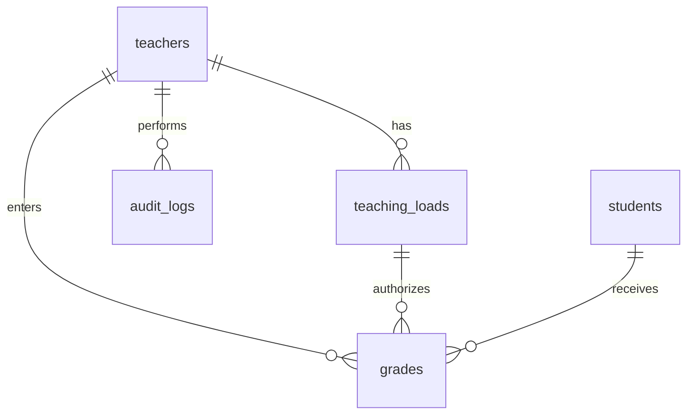
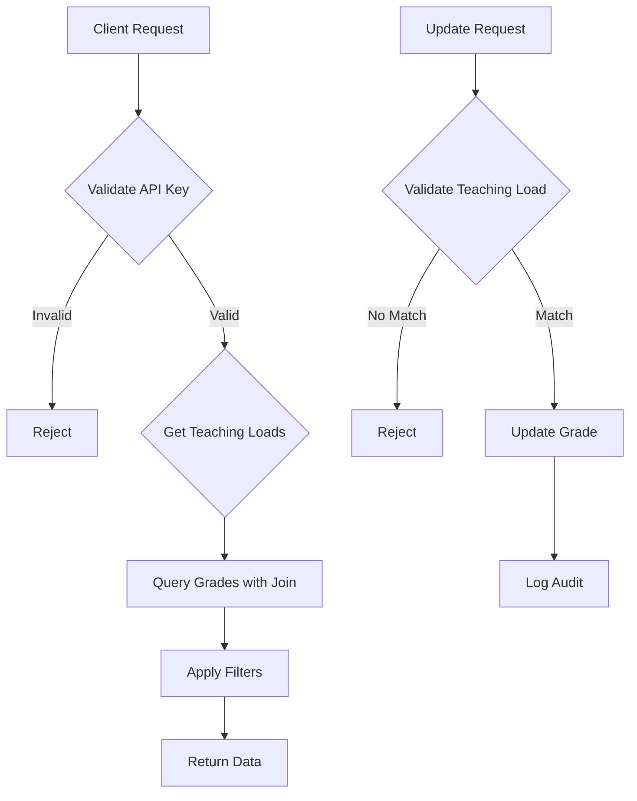

# Teacher API Structure Simulation Plan

## Overview

This plan outlines the simulation of a secure teacher API for managing student grades. The API enforces strict access control through the `teaching_loads` table, uses API key authentication, and addresses deployment considerations for security, performance, and compliance.

## Database Schema

### Tables

1. **teachers**
   - id (PK)
   - name
   - api_key (unique, hashed)
   - active (boolean)
   - expiration_date
   - created_at
   - updated_at

2. **teaching_loads**
   - id (PK)
   - teacher_id (FK to teachers)
   - course_id
   - section
   - year_level
   - program_code
   - school_year
   - semester (0 for K-12, 1-3 for college)
   - role (e.g., subject_teacher, adviser)
   - is_active (boolean, for soft delete)
   - created_at
   - updated_at

3. **students**
   - id (PK)
   - name
   - student_id (unique)
   - program_code
   - year_level
   - section
   - created_at

4. **grades**
   - id (PK)
   - student_id (FK to students)
   - course_id
   - section
   - year_level
   - program_code
   - school_year
   - semester
   - grade_value
   - teacher_id (FK to teachers, for tracking who entered)
   - created_at
   - updated_at

5. **audit_logs**
   - id (PK)
   - teacher_id (FK to teachers)
   - action (e.g., view_grades, update_grade)
   - details (JSON)
   - timestamp

### Relationships

- teaching_loads.teacher_id -> teachers.id
- grades.student_id -> students.id
- grades.teacher_id -> teachers.id
- audit_logs.teacher_id -> teachers.id

### Constraints

- API keys must be unique and hashed.
- Semester values standardized (0 or 1-3).
- Grades can only be inserted/updated if teacher has matching teaching_load.

### Indexing

- Indexes on: teaching_loads(teacher_id, course_id, program_code, year_level, section, school_year, semester)
- grades(student_id, course_id, program_code, year_level, section, school_year, semester)
- teachers(api_key)

## Authentication

- API keys provided in request headers (e.g., X-API-Key).
- Validate key exists, is active, not expired.
- Optional: Generate short-lived session tokens from API keys for per-session revocation.

## Authorization

- For grade access: Query grades joined with teaching_loads on teacher_id, course_id, section, year_level, program_code, school_year, semester.
- Frontend filters applied post-join.
- For updates: Check existence of teaching_load before allowing insert/update.

## API Endpoints

- GET /grades: Retrieve grades for authenticated teacher, with optional filters (school_year, semester, program, section).
- POST /grades: Update grade, validate against teaching_loads.
- GET /teaching-loads: List teacher's assigned loads for frontend dropdowns.
- POST /auth/session: Generate session token (optional).

## Deployment Considerations

- **Security**: Rotate API keys periodically, use HTTPS, hash keys in DB.
- **Performance**: Proper indexing, consider read replicas for large datasets.
- **Validation**: Enforce semester standards, soft delete inactive loads.
- **Auditing**: Log all accesses and modifications.
- **Scalability**: Monitor query performance, use connection pooling.

## Mermaid Diagrams

### Database ER Diagram

### API Flow Diagram

## Simulation Implementation

- Use Express.js for API framework.
- Mock database with in-memory objects or SQLite for simplicity.
- Implement placeholder auth and authz logic.
- Add logging and validation stubs.
